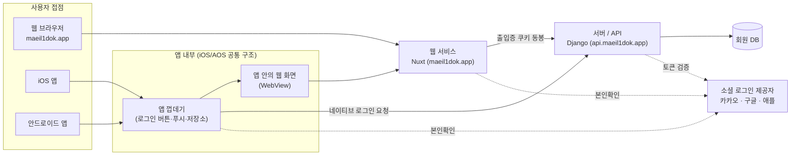
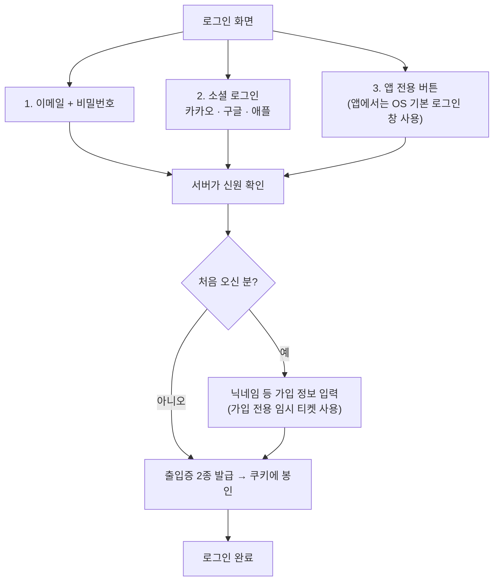
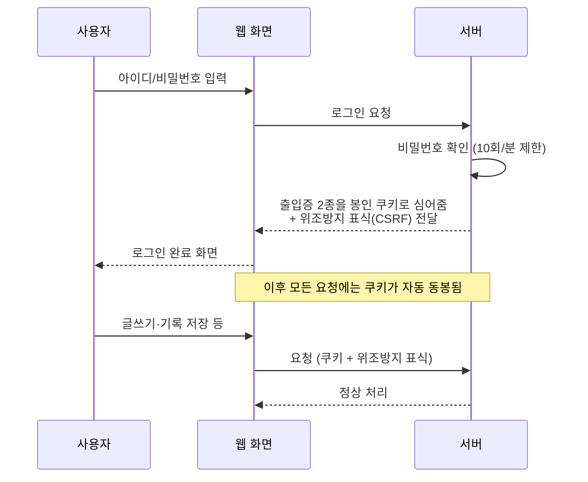
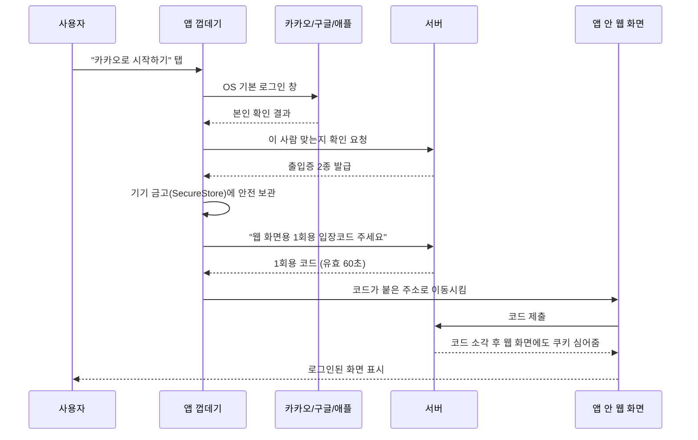
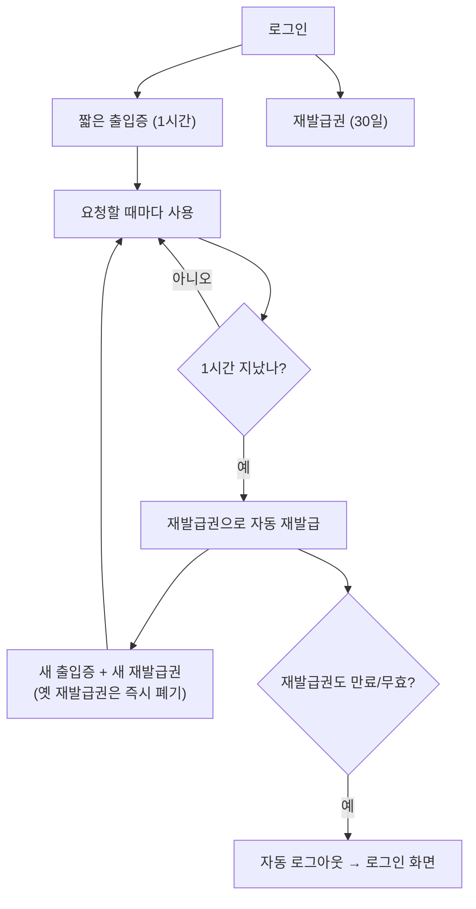
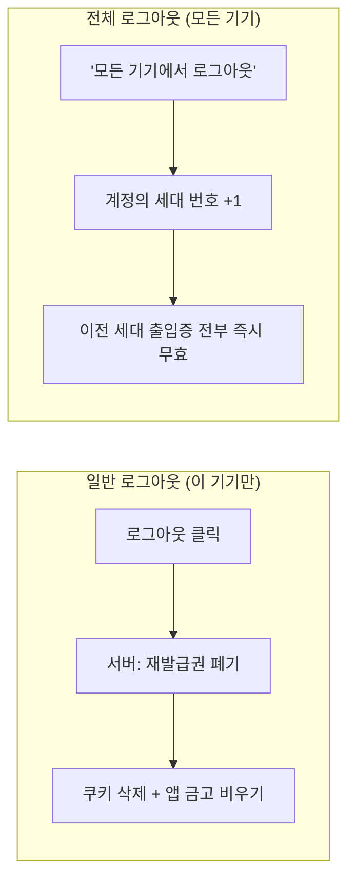
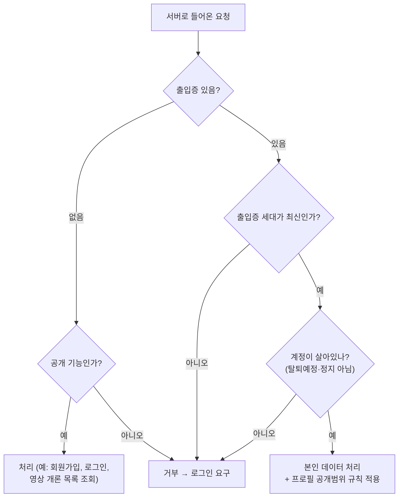

# 매일일독 인증·로그인·세션 구조 안내

> 대상: 기술 배경이 없어도 전체 그림을 파악해야 하는 의사결정자
> 기준: 2026-08-24 현재 `main` 코드 기준 (backend/accounts, frontend/app, mobile)

---

## 0. 30초 요약

매일일독은 **웹(브라우저), iOS 앱, 안드로이드 앱** 세 창구가 있지만,
**실제 화면은 하나(웹)이고 서버도 하나**입니다. 앱은 그 웹 화면을 앱 안에 띄우는 방식입니다.

로그인은 "**출입증(토큰)**"으로 관리합니다.

| 출입증 | 유효기간 | 역할 |
|---|---|---|
| 짧은 출입증 (access) | **1시간** | 매 요청마다 "이 사람 맞다"를 증명 |
| 긴 재발급권 (refresh) | **30일** | 짧은 출입증이 만료되면 새로 받아오는 교환권 |

- 출입증은 브라우저가 **자동으로 들고 다니는 봉인된 쿠키(HttpOnly)** 에 담깁니다.
  → 화면 스크립트가 출입증 값을 읽을 수 없어, 악성 스크립트가 훔쳐 가기 어렵습니다.
- 30일 안에 앱/웹을 다시 열면 **자동 로그인 유지**, 30일 넘게 미접속이면 재로그인입니다.
- "모든 기기에서 로그아웃" 한 번이면 **전 세계 모든 기기의 출입증이 즉시 무효화**됩니다.

---

## 1. 전체 구성도

**핵심 포인트 3가지**

1. 화면(웹)과 서버(API)는 **다른 주소**지만 같은 `maeil1dok.app` 가족이라, 출입증 쿠키를 공유합니다.
2. iOS/AOS는 **동일한 코드 한 벌**입니다. 앱마다 인증 로직이 따로 있지 않습니다.
3. 소셜 로그인 사업자(카카오·구글·애플)는 **"본인 확인"만** 해주고, 매일일독 출입증은 **우리 서버가 직접 발급**합니다.

---

## 2. 로그인 방식은 3가지

- 앱에서는 카카오는 **카카오톡 앱 연동**, 애플은 **iOS 기본 Apple 로그인**, 구글은 **브라우저 창**을 띄웁니다.
- 소셜 계정에 이메일이 있으면 **이메일 인증 완료로 자동 처리**합니다.
- 이미 다른 방식으로 가입한 이력이 있으면 **계정 연동/병합** 절차로 이어집니다(한 사람 = 한 계정 유지).

---

## 3. 웹에서 로그인할 때 (가장 기본)

**여기서 두 겹의 방어가 동시에 작동합니다.**

- **봉인 쿠키(HttpOnly)** — 화면의 어떤 스크립트도 출입증 내용을 읽지 못함 (탈취 방지)
- **위조방지 표식(CSRF 토큰)** — 다른 악성 사이트가 사용자의 쿠키를 몰래 이용해
  글 작성·삭제 같은 요청을 대신 보내는 것을 차단 (변경 요청에만 요구)

---

## 4. 앱에서 로그인할 때 — "세션 브리지"

앱은 구조상 **앱 껍데기**와 **앱 안의 웹 화면**이 분리돼 있습니다.
껍데기에서 로그인해도 웹 화면은 그 사실을 모릅니다. 이 간극을 잇는 장치가 **세션 브리지**입니다.

**왜 1회용 코드를 쓰나요?**
출입증 자체를 주소창에 실어 보내면 기록(로그·이력)에 남아 유출 위험이 큽니다.
그래서 **60초만 살아 있고, 한 번 쓰면 즉시 소각되는 임시 코드**만 전달합니다.

**앱을 다시 켰을 때**: 껍데기가 금고에 보관한 30일짜리 재발급권으로 조용히 새 출입증을 받고,
같은 1회용 코드 절차로 웹 화면까지 로그인 상태를 맞춰줍니다. → 사용자는 아무것도 안 해도 됩니다.

---

## 5. 세션(로그인 유지)이 흐르는 방식

자동 재발급이 일어나는 시점은 세 가지입니다.

1. **5분마다** 백그라운드에서 미리 갱신
2. 앱/탭을 다시 **화면에 띄웠을 때**
3. 요청이 "만료됨" 응답을 받으면 **즉시 갱신 후 자동 재시도** (사용자는 실패를 못 느낌)

> **재발급권 회전(rotation)**: 갱신할 때마다 재발급권도 새것으로 바꾸고 옛것은 블랙리스트에 넣습니다.
> 누군가 옛 재발급권을 훔쳐 써도 이미 무효라 통하지 않습니다.

---

## 6. 로그아웃 / 전체 기기 로그아웃

- 계정마다 **세대 번호(token_version)** 가 있고, 모든 출입증에 그 번호가 찍혀 있습니다.
- 번호를 올리면 기존에 뿌려진 출입증이 **한 번에 전부** 못 쓰게 됩니다.
  (비밀번호 변경·기기 분실 상황의 안전장치)
- 로그아웃은 **출입증이 이미 만료된 상태에서도** 항상 동작하도록 열려 있습니다.

---

## 7. 권한(인가) — 누가 무엇을 볼 수 있나

**기본 원칙은 "전부 잠금"입니다.** 서버의 모든 기능은 기본값이 *로그인 필수*이고,
회원가입·로그인·비밀번호 재설정·일부 공개 콘텐츠만 **명시적으로 열어둔 예외**입니다.

추가로 걸려 있는 안전장치:

| 항목 | 내용 |
|---|---|
| 로그인 시도 제한 | 분당 10회 (무차별 대입 차단) |
| 비밀번호 재설정 | 시간당 5회 |
| 이메일 인증 발송 | 시간당 5회 |
| 비로그인 일반 요청 | 시간당 100회 |
| 로그인 사용자 요청 | 시간당 1,000회 |

---

## 8. 보안 장치 한눈에 보기

| 위험 | 우리가 한 조치 | 쉬운 설명 |
|---|---|---|
| 출입증 탈취 | HttpOnly 쿠키 | 화면 스크립트가 출입증을 못 읽음 |
| 통신 도청 | HTTPS 강제 + HSTS | 항상 암호화된 길로만 통신 |
| 대리 요청(CSRF) | 위조방지 표식 검사 | 남의 사이트가 내 권한을 못 빌림 |
| 다른 사이트에서의 접근 | 허용 주소 목록(CORS) | 매일일독 도메인에서만 API 사용 가능 |
| 출입증 오래 남음 | 1시간 만료 + 회전 | 훔쳐도 오래 못 씀 |
| 기기 분실 | 전체 로그아웃 | 모든 출입증 일괄 무효화 |
| 가짜 링크 유도 | 이동 주소 화이트리스트 | 우리 도메인 내부 경로로만 이동 허용 |
| 앱 딥링크 악용 | 출처 검증 + 문자 이스케이프 | 외부 링크가 앱 안에서 코드 실행 못 함 |
| 앱 내 출입증 보관 | OS 보안 금고(SecureStore) | iOS 키체인 / 안드로이드 암호화 저장소 |

---

## 9. 알아두면 좋은 현재 상태 (개선 여지)

솔직하게 남깁니다. 지금 당장의 사고 요인은 아니지만, 정리해두면 좋은 항목입니다.

1. **과거 호환용 통로가 아직 열려 있습니다.**
   쿠키 방식으로 전환했지만, 예전 방식(응답 본문의 토큰·Authorization 헤더)도 함께 받아줍니다.
   앱이 이 통로를 실제로 쓰고 있어 당장 닫을 수는 없고, 앱 구조 정리 후 닫는 것이 목표입니다.
2. **로그인 응답 본문에도 출입증이 함께 담깁니다.** (위 호환성 때문)
   쿠키만으로 충분해진 시점에 본문에서 제거하면 노출면이 한 단계 더 줄어듭니다.
3. **엔드포인트별 "공개/비공개" 판단 로직이 웹 화면 코드에도 일부 들어 있습니다.**
   서버가 최종 판정을 하므로 보안 구멍은 아니지만, 규칙이 두 군데 있으면 유지보수 비용이 늘어납니다.

---

## 10. 상사 보고용 결론 3줄

- 로그인 방식은 **이메일 + 소셜 3종**, 화면은 **웹 한 벌**, 서버는 **한 곳**입니다. iOS/AOS는 같은 구조를 공유합니다.
- 세션은 **1시간 출입증 + 30일 재발급권**으로 굴러가며, 사용자는 30일간 재로그인 없이 씁니다.
- 업계 표준 보안 장치(봉인 쿠키·CSRF·HTTPS 강제·요청 횟수 제한·전체 로그아웃)는 **모두 적용돼 있습니다.**
  남은 과제는 보안 결함 해소가 아니라 **과거 호환 통로 정리**입니다.
