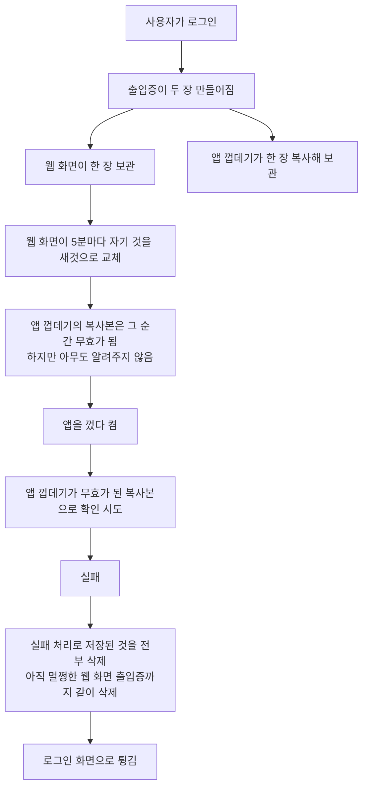
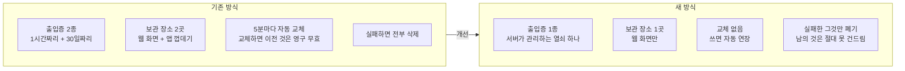
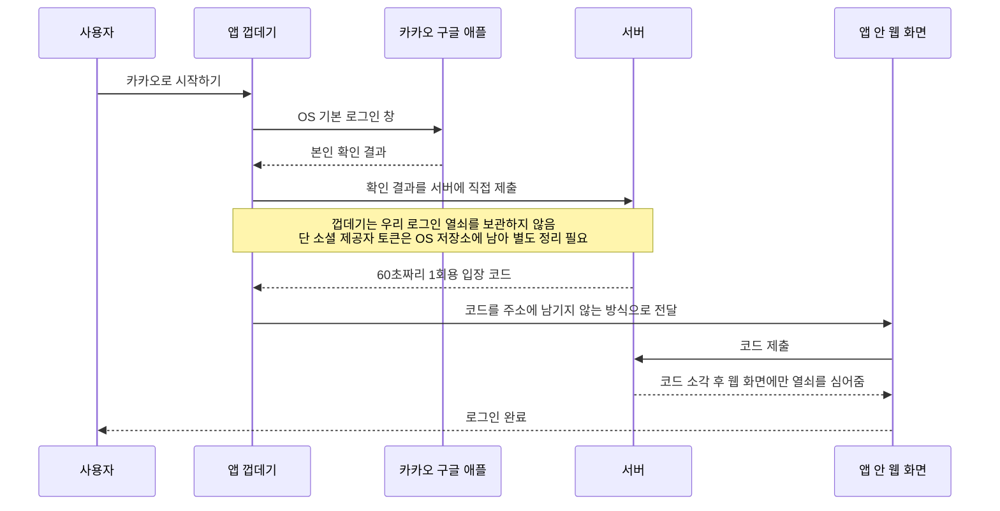
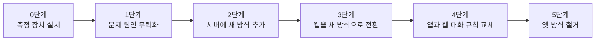
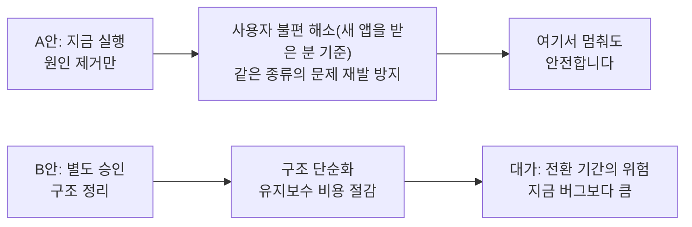
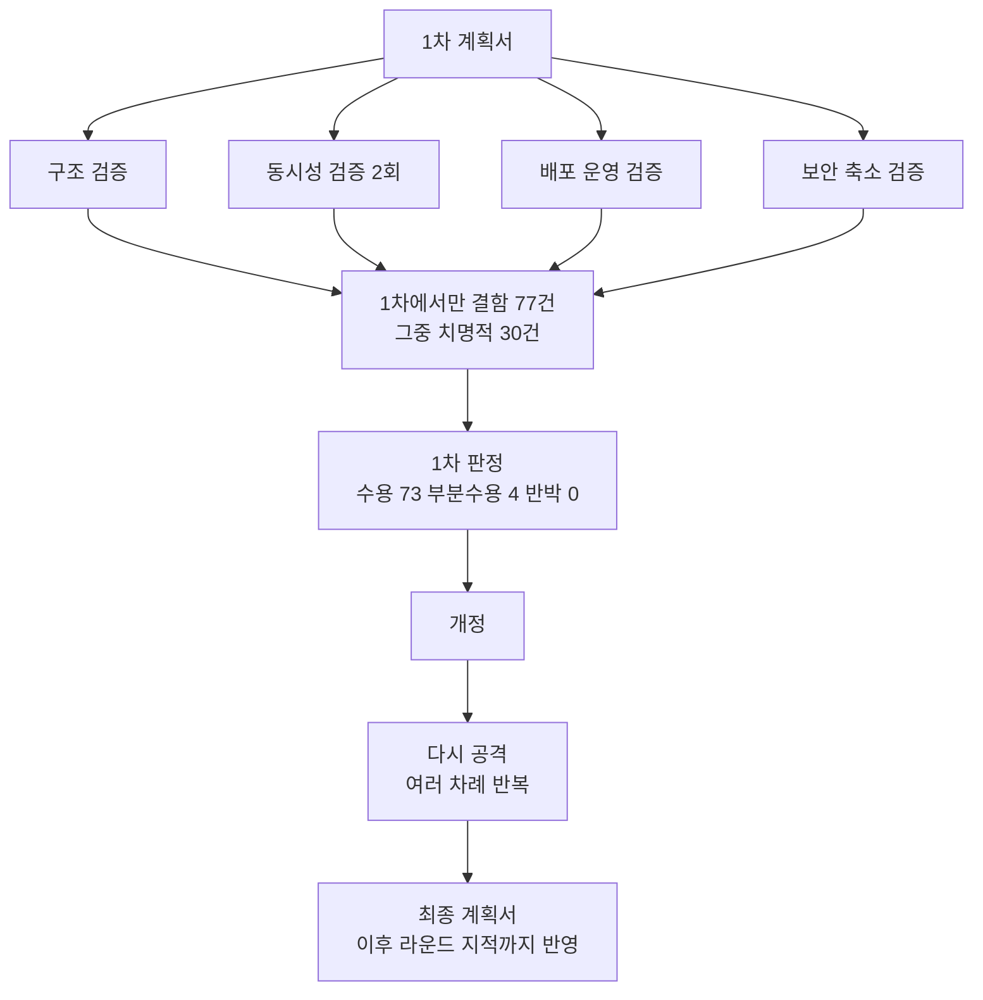

# 로그인 유지 문제 개선 계획 보고

> 대상: 기술 배경이 없어도 판단해야 하는 의사결정자
> 기준일: 2026-08-24 · 추적 번호: LAB-60
> 상세 실행 계획: `.omo/plans/auth-session-ssot-migration.md`

---

## 1. 한 장 요약

**증상**: 앱에서 로그인이 자주 풀립니다.

**원인**: 버그가 아니라 **설계의 필연**이었습니다. 로그인 상태를 증명하는 "출입증"을 **앱 껍데기와 웹 화면이 각자 한 장씩** 들고 있는데, 둘 중 하나가 갱신하면 나머지 한 장은 그 순간 무효가 됩니다. 그런데 무효가 된 쪽이 자기 출입증을 확인하다 실패하면 **아직 멀쩡한 상대방 출입증까지 지워버립니다.**

**정도**: **앱을 5분 이상 켜 둔 채 쓴 뒤**에 껐다 켜면 **반드시 로그아웃**됩니다. 가끔이 아니라 매번입니다. (조건을 정확히 적자면 "로그인 후 5분 경과"가 아니라 **"앱을 5분 이상 실제로 사용"**입니다 — 화면이 열려 있는 동안에만 열쇠 교체가 일어나므로, 로그인하고 바로 앱을 끄면 5분이 지나도 로그아웃되지 않습니다. 대신 앱을 조금이라도 붙잡고 쓴 사용자는 전원 걸립니다.)

**해법**: 출입증을 **한 곳에서만 관리**하도록 바꿉니다. 앱 껍데기는 출입증을 아예 갖지 않습니다. 갖지 않으면 낡을 수 없고, 낡지 않으면 남의 것을 지울 이유도 없습니다. 고치는 게 아니라 **문제가 생길 수 없게** 만듭니다.

**비용과 순서**: 전체 개선은 6단계지만, **1단계까지만 해도 사용자가 겪는 로그아웃 문제는 **새 앱을 받은 분들에게서** 끝납니다.** 1단계는 **원칙적으로** 앱스토어 심사가 필요 없습니다 — 다만 **앱을 심사 없이 고치는 경로가 실제로 열려 있는지 아직 확인되지 않았고**(아래 7절의 "앱 무선 업데이트가 실제로 도달하는지" 항목), 닫혀 있으면 앱 쪽 수정은 심사를 한 번 거쳐야 합니다. 서버·웹 쪽 작업은 어느 경우든 영향받지 않습니다. 또한 실제 기기에서 사람이 24시간 관찰해야 하는 확인 항목이 있어, 그 결과가 나온 뒤에 배포가 확정됩니다. 2단계 이후는 구조 정리이며 급하지 않습니다.

---

## 2. 지금 무슨 일이 벌어지고 있나

핵심은 마지막 두 칸입니다. **자기 것이 실패했다는 이유로 남의 멀쩡한 것까지 지웁니다.** 이게 사용자가 "자주 풀린다"고 느끼는 정확한 이유입니다.

이 구조를 임시로 떠받치느라 지난 12개월 동안 인증 관련 코드 수정이 **69건** 있었습니다(같은 기간 전체 945건 중). 여기서 "인증 관련"은 **서버의 `backend/accounts` 전체와 웹의 인증 파일 세 개(`useAuthService.ts`·`useAuthGuard.ts`·`native-app.client.ts`)** 를 손댄 커밋을 뜻합니다(앱 껍데기 `mobile/App.tsx`는 이 집계에 **포함되지 않습니다**). 세는 방법은 상세 계획서에 명령까지 적어 두었습니다(누구든 같은 숫자를 다시 뽑을 수 있습니다). 고쳐도 다시 터지는 자리였습니다.

> 산출 근거: `backend/accounts` 전체와 웹 인증 파일 세 개(`useAuthService.ts`·`useAuthGuard.ts`·`native-app.client.ts`)를 건드린 최근 12개월 커밋 수입니다. **앱 껍데기(`mobile/App.tsx`)는 포함하지 않습니다** — 넣으면 숫자가 달라지므로, 상세 계획서에 적힌 명령 그대로만 인용해 주십시오.

---

## 3. 기존 방식과 새 방식 비교

> **이 표의 "새 방식"은 전체 목표(B안까지 갔을 때)의 모습입니다.** 지금 승인을 요청드리는 A안은 **문제의 원인인 파괴 동작만 제거**하며, 출입증의 개수와 로그인 유지 기간은 **지금과 같습니다.** 아래 표는 "어디로 가려는가"이지 "A안이 무엇을 바꾸는가"가 아닙니다.

| 항목 | 기존 방식 | 새 방식 | 사용자에게 미치는 영향 |
|---|---|---|---|
| 출입증 개수 | 2종 (1시간용 + 30일용) | **1종** (단, 구 버전 앱용 예외 경로 1개는 영구 유지) | 어긋날 짝이 없어짐 |
| 보관 장소 | 웹 화면과 앱 껍데기 두 곳 | **웹 화면 한 곳** | 낡은 복사본이 존재하지 않음 |
| 갱신 방식 | 5분마다 교체, 이전 것은 영구 무효 | **교체 없이 사용할 때마다 연장** | 갱신 충돌 자체가 사라짐 |
| 실패 처리 | 저장된 것을 전부 삭제 | **실패한 그것만 폐기** | 멀쩡한 로그인이 파괴되지 않음 |
| 인터넷이 끊겼을 때 | 로그아웃으로 오인 | **오프라인 안내만 표시** | 지하철에서 로그아웃되지 않음 |
| 모든 기기 로그아웃 | 한쪽만 처리돼 되살아날 수 있음 | **양쪽이 하나의 세대 번호로 묶임** | 로그아웃이 실제로 유지됨 |
| 앱과 웹 간 대화 | 정해진 규칙 없이 7종이 제각각 | **5종을 한 파일에 계약으로 고정** | 앱과 웹 버전이 어긋나도 안 깨짐 |
| 로그인 유지 기간 | 30일 | **90일 (쓰면 연장, 단 최대 180일)** | 매일 쓰는 사용자도 180일마다 한 번은 다시 로그인 |

---

## 4. 새 방식에서 로그인은 이렇게 흐릅니다

**앱 껍데기는 열쇠를 한 번도 갖지 않습니다.** 본인 확인 결과를 서버에 넘기고 1회용 코드만 잠깐 들고 있다가 버립니다. 그래서 낡은 열쇠로 사고를 칠 수가 없습니다.

이 1회용 코드 방식은 **원래 계획에서 없애려던 것**인데, 검증 과정에서 **없애면 안 된다**는 결론이 나와 유지하기로 바꿨습니다(아래 6절 참조).

---

## 5. 작업 순서와 일정 성격

| 단계 | 하는 일 | 배포 대상 | 앱스토어 심사 | 사용자 체감 |
|---|---|---|---|---|
| 0 | 준비 단계입니다. **서버에만 설치되는 측정 장치 네 가지**(요청 헤더 허용, 인증 수단 기록, 만료 전 강제 로그아웃(refresh 401) 원인별 계수, 그 기록을 **3주간 보존하는 저장소**)**는 A안에 포함**됩니다 — 심사가 필요 없고, 문제가 생겼을 때 되돌릴지 판단할 근거를 서버에서 바로 얻기 위해서입니다. **보존 저장소를 A안에 넣은 이유**: 현재 서버 로그는 30MB만 순환 보관돼 트래픽이 조금만 늘어도 배포 전 기록이 밀려 사라집니다. 비교할 기준이 사라지면 문제가 생겨도 알아챌 수 없으므로, 이 저장소는 **측정 장치 중 가장 먼저**, 즉 나머지 세 가지보다 앞서 만듭니다(A안 전체에서 가장 먼저는 아닙니다 — **무선 업데이트가 되는 경우** 앱 런타임 확인과 보안 핫픽스가 그보다 앞섭니다. **스토어 심사를 거쳐야 하는 경우에는 반대로** 이 저장소와 서버·웹 작업이 먼저 나가고 앱 관련 항목은 스토어 빌드에 묶여 뒤로 갑니다). **앱 시험 배포 경로 확보와 쿠키 유지 확인도 A안**입니다. B안에 남는 것은 **앱 쪽 측정 채널과 기기 단위 집계**입니다 — "몇 명이 새 앱을 받았는가"처럼 기기를 세어야 하는 지표가 그쪽이고, A안의 저장소는 그 계산을 하지 않습니다 | 서버, 앱(무선 업데이트) | **서버 부분은 불필요. 앱 부분은 아래 7번 확인 결과에 따라 심사가 필요할 수 있음** | 변화 없음 |
| **1** | **문제의 원인인 "남의 것까지 삭제" 동작을 제거합니다** | **서버 + 웹 + 앱(무선 업데이트)** | **서버·웹은 불필요. 앱 부분은 아래 7번 확인 결과에 따라 심사가 필요할 수 있음** | **로그아웃 문제 해소(새 앱을 받은 분 기준)** |
| 2 | 서버에 새 방식을 추가하되 옛 방식도 그대로 둡니다 | 서버(웹과 함께 배포) | 불필요 | 변화 없음 |
| 3 | 웹 화면이 새 방식만 쓰도록 전환합니다 | 웹(서버와 함께 배포) | 불필요 | 변화 없음 |
| 4 | 앱과 웹의 대화 규칙을 새 계약으로 교체합니다 | 웹 먼저, 앱 나중 | 불필요 (무선 업데이트) | 변화 없음 |
| 5 | 더 이상 쓰지 않는 옛 방식을 철거합니다 | 서버, 웹 | 불필요 | 변화 없음 |

### 검증 결과 계획을 둘로 쪼갰습니다

여섯 단계를 한 묶음으로 진행하려던 것을, 외부 검증에서 **"그렇게 하면 안 된다"**는 판정을 받고 나눴습니다. 이유는 단순합니다.

| | A안 (지금) | B안 (나중, 별도 승인) |
|---|---|---|
| 하는 일 | 앱이 남의 것까지 지우는 동작을 제거. 여기에 **함께 들어가는 변경 다섯 가지**가 있습니다 — (1) 로그아웃을 앱이 아니라 웹이 직접 수행하고 **결과와 무관하게 이 기기에서 확실히 종료**, (2) **서버도 함께 바뀝니다** — 로그아웃할 때 그 사용자에게 발급됐던 미사용 출입 코드를 서버가 무효화합니다(그러지 않으면 늦게 도착한 코드가 방금 끝낸 로그인을 되살릴 수 있습니다). **다만 이 무효화는 서버가 "누가 로그아웃하는지" 알아볼 수 있을 때만 동작합니다** — 알아볼 근거가 없는 경우에는 건너뛰고, 그 경우에는 앱 쪽에서 진행 중인 작업을 멈추고, **로그아웃을 마치는 순간 앱이 로그인 흔적을 한 번 더 지우는 절차**가 대신 막습니다(마지막 확인 절차는 그 결과를 기록만 하고 직접 지우지는 않습니다), (3) 인터넷이 끊겼을 때 로그인 화면으로 튕기는 대신 **중립적인 잠금·재시도 화면**을 표시하되, **그 화면에서 사용자가 직접 "로그인"이나 "다른 계정으로 로그인"을 누를 수 있게** 합니다(자동으로 튕기지 않을 뿐, 로그인하려는 분을 막지는 않습니다). 덧붙여 서버가 계속 오류를 내는 상황에서 앱이 **무한정 같은 시도를 반복하지 않고 간격을 늘려가며 재시도**하도록 했습니다(데이터·배터리 낭비 방지), (4) **"다른 계정으로 로그인" 동작을 새로 만듭니다** — 로그아웃 후 로그인 화면에서 이 항목을 고르면 계정을 바꿔 로그인하는 경로로 들어가고, **평소 로그인은 지금과 똑같이 동작합니다**(매번 계정을 고르게 하지 않습니다). **다만 실제로 계정 선택 화면이 뜨는지는 소셜 로그인 업체마다 다릅니다** — **구글만 보장**되고, **카카오는 최선 노력**(카카오 쪽 로그인 상태에 따라 같은 계정으로 조용히 들어갈 수 있습니다), **애플은 기술적 방법이 없어 예외**입니다(아래 승인 항목 2번), (5) 아래 보안 구멍 수정. **앱이 켜질 때의 동작 순서는 손대지 않습니다**(이는 "아직 앱을 업데이트하지 못한 분들에게 **이번 변경으로 인한 불이익이 없다**"는 뜻이지, "그분들의 문제가 지금 해결된다"는 뜻은 아닙니다 — 그분들의 문제는 **새 앱을 받으신 뒤에** 해소됩니다) — 검토 과정에서 그 순서까지 바꾸려던 설계를 넣었다가, 그것이 앱 화면 전환과 충돌해 오히려 로그인 복구를 깨뜨릴 수 있다는 지적을 받고 **뒤 단계로 미뤘습니다** | 출입증을 한 종류로 줄이고 옛 방식 철거 |
| 걸리는 시간 | 짧음. 단 **측정 장치를 먼저 켜고 7일간 기준선을 쌓은 뒤에야 실제 수정을 배포**합니다(비교할 기준이 없으면 문제가 생겨도 알아챌 수 없습니다). 여기에 사람이 직접 확인하는 24시간 관찰이 더해집니다 | 김 (선행 준비 3건 포함) |
| 위험 | 낮음. 다만 되돌리는 방법이 **앱 업데이트 방식에 따라 갈립니다.** **무선 업데이트가 되는 경우**: **앱을 먼저** 이전 버전으로 되돌리고 **그다음 웹과 서버를 함께** 되돌립니다(내보낼 때는 반대로 웹·서버가 먼저, 앱이 나중입니다). 짧은 서버 재기동이 따릅니다. **스토어 심사를 거쳐야 하는 경우에는 앱을 즉시 되돌릴 수 없습니다** — 이미 새 앱을 받은 분에게 옛 버전을 바로 밀어 넣을 방법이 없기 때문입니다. 그때는 **(1) 배포 확대를 즉시 중단**해 아직 받지 않은 분을 보호하고, **(2) 웹과 서버는 그대로 둡니다** — 새 앱을 받은 분에게는 그것이 짝이 맞는 상대라서 먼저 되돌리면 그분들만 어긋난 조합에 갇힙니다, **(3) 이전 버전 재출시나 수정 버전으로 앱을 바로잡고**, **(4) 그것이 기기에 도달한 뒤에야** 웹·서버 되돌리기를 판단합니다 | 전환 기간 동안 **두 방식이 동시에 돌아감** |
| 사용자 효과 | **로그아웃 문제 해결(새 앱을 받은 분 기준)** | 눈에 보이는 변화 없음 |
| 앱스토어 심사 | 웹·서버는 불필요. **앱 부분은 조건부**(아래 7번) | 불필요 |

**배포 순서 주의**: A안은 **서버·웹·앱 세 곳**을 건드립니다. 순서가 안전에 직결되어 **로그아웃 수정이 담긴 앱 배포**는 **서버와 웹을 함께 먼저 배포해 확인한 뒤에** 해야 하며(서버·웹은 한 번에 나가는 구조입니다), **이 규칙은 그 앱 배포에만 적용됩니다** — 앞선 두 항목(앱 업데이트 도달 확인용 빈 배포, 보안 핫픽스)은 서버·웹 변경을 담지 않으므로 이 순서에 걸리지 않으며, **무선 업데이트가 되는 경우 먼저 나갈 수 있습니다.** 스토어 심사를 거쳐야 하는 경우에는 그 둘도 앱 빌드에 묶이므로 **서버·웹 작업이 먼저 끝난 뒤** 나갑니다. 되돌릴 때는 **무선 업데이트가 되는 경우** 앱을 먼저 되돌리고 그다음 서버·웹을 함께 되돌립니다. **스토어 심사를 거쳐야 하는 경우에는 앱을 즉시 되돌릴 수 없으므로** 배포 확대를 중단하고 서버·웹은 그대로 둔 채 앱을 재출시로 바로잡습니다(위 위험 항목에 절차를 적었습니다). 이 순서를 배포 스크립트가 자동으로 강제하도록 만드는 것도 A안에 포함돼 있습니다(그 강제도 위와 같이 **로그아웃 수정이 담긴 앱 배포에만** 걸립니다). **다만 그 장치가 완성되기 전까지는 배포 담당자가 직접 확인합니다** — 웹이 올바른 버전으로 배포됐는지와 옛 앱에서 로그아웃·재시작이 정상인지를 기록으로 남기고, 그 기록이 없으면 앱 배포를 진행하지 않습니다.

**핵심 판단**: 사용자가 겪는 문제는 **새 앱을 받은 분들에게서** A안으로 끝나고, **"다시는 이런 종류가 생기지 않게" 하는 것까지 A안이 합니다.** B안은 **구조를 단순하게 만들어 앞으로의 관리 비용을 줄이는 청소**이며, 전환 기간이 오히려 지금보다 위험할 수 있어 **급하게 할 이유가 없습니다.** (위 그림과 같은 이야기입니다 — 이 문장의 이전 판은 재발 방지를 B안의 몫으로 적어 그림과 어긋나 있었고, 그대로 두면 B안을 안전에 꼭 필요한 후속으로 오해하실 수 있었습니다.)

또한 B안을 시작하려면 **지금 없는 것 세 가지**를 먼저 정해야 한다는 사실이 검증에서 드러났습니다: 기능을 켜고 끄는 스위치, **기기 단위 측정 집계**(기록을 3주간 남기는 저장소 자체는 A안에서 만들지만, "몇 대가 새 앱을 받았는가"를 세는 집계는 아직 없습니다), 그리고 **되돌리는 절차의 확정**입니다. 현재는 로그가 약 30MB만 순환 보관되고 웹과 서버가 한 명령으로 함께 배포되므로, 계획서가 약속했던 측정과 롤백이 **말로만 존재하는 상태**였습니다.

세 번째 항목은 "웹과 서버를 따로 되돌릴 수 있게 만든다"가 **아닙니다.** 검증 결과 이 배포 구조에서는 분리가 불가능하다는 결론이 나왔고, 그래서 **분리를 포기하고 결합을 받아들이되 그 사실에 맞는 절차를 문서로 확정**하는 쪽을 택했습니다.

**로그아웃이 실패하면 어떻게 되는지도 정해 두었습니다.** 인터넷이 끊겼거나 서버가 응답하지 않는 상태에서 로그아웃을 누르면, 앱이 **최대 9초 동안 정상 종료를 시도한 뒤** 응답이 없으면 **이 기기에서 강제로 로그아웃합니다**. **이 9초 흐름은 새 앱을 받으신 분에게만 해당합니다** — 아직 업데이트하지 못한 앱에서는 지금과 동일하게 **앱이 직접 로그아웃을 처리**하며, 화면과 걸리는 시간이 다를 수 있습니다(재시작 후 로그아웃돼 있다는 결과는 양쪽 모두 같고, 검수도 양쪽 모두에 대해 합니다) — 결과는 지금과 같습니다(다시 켜도 로그인 화면이 뜹니다). 바뀌는 것은 **그 최대 9초 동안 로그아웃이 끝나기를 기다리는 화면이 보인다**는 점이며, 그동안에는 로그인 화면으로 넘어가지 않습니다(중간에 새로 로그인해 버리면 방금 누른 로그아웃과 뒤엉키기 때문입니다). **정리가 확인되지 않은 채로는 로그인한 상태의 화면을 다시 열지 않도록** 만들었습니다 — 그런 경우에는 앱이 스스로 마무리하고 **자체 로그인 화면**으로 넘깁니다. 이 둘은 다릅니다: **로그인한 내용이 보이는 화면은 열리지 않고, 로그인하라는 화면은 열립니다.** 즉 **"정리가 안 됐는데 로그인한 화면이 다시 보이는" 경로는 없습니다** — 정리 완료를 확인하지 못한 경우 앱이 그 사실을 기억해 **다음 실행 때 다시 정리하고, 그때까지는 로그인 화면만** 보여줍니다. (정리 시도가 두 번 다 응답하지 않는 드문 경우까지 포함한 표현입니다.) 다만 서버 쪽 기록은 남을 수 있는데, 이것은 **지금도 똑같은 상태**이며 A안이 새로 만드는 문제가 아닙니다. 검토 과정에서 이 부분까지 A안에서 고치려는 설계를 넣었다가, **그 설계가 오히려 사용자를 앱 안에 가둘 수 있다**는 지적을 세 차례 받고 걷어냈습니다. 이 문제는 B안에서 구조가 단순해진 뒤에 고치는 것이 맞습니다.

**전원 로그아웃은 하지 않습니다.** 이 서비스는 통독 연속 기록을 쌓는 앱이라, 강제 로그아웃은 불편이 아니라 **끊긴 기록**입니다. "로그아웃 문제를 고쳤습니다"를 전원 로그아웃으로 알릴 수는 없어서, 사용자가 아무것도 눈치채지 못하게 조용히 전환하는 방식을 택했습니다.

---

## 6. 이 계획을 어떻게 검증했나

계획을 그냥 쓰지 않고, **서로 다른 인공지능 모델 5종에게 여러 관점으로 나눠 이 계획을 무너뜨려 보라고 시켰습니다.** 매 차례 지적을 반영한 뒤 다시 공격받게 했고, 이 과정을 여러 라운드 반복했습니다. 1차 라운드에서만 결함 77건(치명적 30건)이 나왔고, 그중 73건을 수용, 4건을 부분 수용, 반박은 0건이었습니다.

발견된 결함 중 **의사결정자가 알아야 할 것 세 가지**:

1. **원래 계획의 한 결정이 틀렸습니다.** 1회용 코드 방식을 없애려 했는데, 두 모델이 서로 모르는 상태에서 같은 결론을 냈습니다 — 없애면 본인 확인 결과가 웹 화면 안을 지나가게 되어 **지금보다 위험해집니다.** 되돌렸습니다.

2. **원래 계획의 측정 방법이 틀렸습니다.** 로그아웃 횟수를 웹 화면에서 세려 했는데, 문제가 터지면 앱이 **웹 화면을 아예 띄우지 않고** 로그인 화면으로 갑니다. 즉 고치려는 문제가 측정에 잡히지 않습니다. 서버에서 세도록 바꿨습니다.

3. **보안 검사 하나가 누락돼 있었습니다.** 현재 서버는 외부 사이트가 사용자 권한을 몰래 빌려 쓰는 것을 막는 검사를 하고 있는데, 새 방식 설계에 그 얘기가 빠져 있었습니다. **현행 검사를 그대로 유지**하도록 명시했습니다.

세 가지 모두 **실제 코드와 대조해 사실 확인을 마쳤습니다.**

**검증 성적도 그대로 알려드립니다.** 최종 관문 심사를 여러 차례 돌렸고 현재까지 **통과 22회 / 보완요구 99회**입니다(보완요구는 심사 회차 수이며, 한 회차에서 여러 건이 나와도 1회로 셉니다). 승인 기준은 **"연속 5회 통과"에서 "연속 3회 통과"로 완화**했고 심사자도 **두 계열(Claude·GPT)** 로 한정했습니다 — 심사 자체의 엄격함은 그대로 두고, 통과에 필요한 연속 횟수만 낮춘 것입니다. 그 기준으로도 **아직 달성하지 못했습니다** — 심사 기준을 하나로 고정한 뒤 **2회 연속 통과**까지 왔지만, 그 뒤 자체 점검에서 계획서의 **작업 규범 자체를 고쳐야 하는 결함**(로그아웃 대기 시간 상한이 문서에 없던 문제)을 찾았습니다. 심사자가 승인한 판본과 지금 판본이 달라졌으므로 **연속 기록을 0으로 되돌렸습니다**. 그 뒤 심사를 다시 돌려 **세 차례 연속 보완 요구**를 받았고(모두 로그아웃 대기 시간 계산에서 빠진 단계를 지적한 것으로, 세 번 모두 수정했습니다), 그 뒤 **두 차례 연속 통과**를 받았습니다. 두 번째 심사자에게는 **앞선 심사자의 결론을 그대로 인정하지 말고 처음부터 다시 따져 보라**는 조건을 걸었고, 그 결과가 앞선 판정과 일치했습니다. 그런데 **세 번째 심사에서 다시 보완 요구가 나와 연속 기록은 0회로 되돌아갔습니다** — 지적된 것은 두 가지입니다. 첫째, **담당자가 기기 식별 문자열을 수집해 넘겨주는 절차**가 개별 작업 설명 안에는 있는데 **전체 진행 순서에는 빠져 있어서**, 그 수집이 끝나기 전에 7일 측정 창이 시작될 수 있었습니다(그러면 잘못된 기준값으로 되돌릴지 말지를 판정하게 됩니다). 둘째, **애플 예외 승인**(아래 8절 승인 요청 2번)을 받는 시점이 순서에 없어서, 배포를 다 한 뒤에 승인이 나지 않으면 되돌려야 하는 상황이었습니다. 둘 다 순서에 명시 단계로 넣어 고쳤습니다. **네 번째 심사에서도 한 건이 더 나왔습니다** — 같은 작업 안에서 앞 문단은 "쿠키가 기기 저장소에서 실제로 사라졌는지 반드시 확인하라"고 요구하는데, 뒤 문단은 그 확인 수단을 금지하고 있었습니다. 뒤 문단이 낡은 것이어서(더 이른 판의 규칙을 참조하고 있었습니다) 이를 지우고, **출시되는 앱에는 위험한 호출이 없어야 하고 검사용 별도 빌드에서는 확인 수단을 써도 된다**로 정리했습니다. 이 지적들은 **앞선 두 통과 심사가 보지 못한 종류**였습니다 — 앞선 심사는 전체 순서가 스스로 앞뒤가 맞는지만 확인했고, **문단끼리 서로를 부정하는지는 대조하지 않았습니다**. 공통점이 하나 보였습니다: 지금까지 나온 결함은 대부분 **이전 수정이 남긴 잔재**, 즉 이미 바뀐 전제를 그대로 참조하는 문장이었습니다. **그래서 다섯 번째 심사에는 "결함은 거의 전부 그 잔재일 것이다"라는 단서를 미리 알려 주고 그 유형만 집중해서 찾게 했습니다 — 일곱 건이 나왔고 일곱 건 모두 그 유형이었습니다.** 예를 들어 계획서 한 곳은 저장 방식을 A로 지정하는데 네 줄 뒤에서 "A는 쓸 수 없다"며 B를 규정하고 있었고(앞 문장이 낡은 것이었습니다), 이 브리핑도 핫픽스를 내보내기 전에 확인할 항목을 잘못 가리키고 있었습니다(고쳤습니다 — 핫픽스는 **무선 업데이트가 되는 경우** 서버 작업을 기다리지 않고 가장 먼저 나갈 수 있고, 스토어 심사를 거쳐야 하는 경우에는 앱 빌드에 묶여 서버 작업 뒤로 갑니다). 같은 단서를 직접 적용해 심사자도 놓친 두 건을 추가로 찾았습니다. **이 방식이 효과가 확인됐으므로 남은 심사에도 계속 싣습니다.** 여섯 번째 심사에는 한 가지를 더 얹었습니다 — **이미 고친 항목 열두 개를 이름으로 알려 주고 "그건 빼고, 아직 아무도 들여다보지 않은 부분을 보라"**고 지시했습니다. 그러자 **되돌리기 절차표**와 **앱의 재시도 규칙**에서 각각 한 건씩 나왔습니다(둘 다 앞선 심사들이 손대지 않은 곳입니다). 되돌리기 표는 무엇을 되돌려야 하는지 한 항목을 빠뜨리고 순서도 반대로 적고 있었는데, 그대로 따르면 되돌린 뒤에도 문제가 남을 수 있었습니다. 또 이 브리핑의 문장 하나도 실제보다 넓게 적혀 있어 고쳤습니다(위 "정도" 항목 — 로그인 후 5분이 아니라 **앱을 5분 이상 사용한 뒤**가 정확합니다). **닫힌 항목을 미리 알려 주지 않으면 심사자가 이미 고친 것을 다시 찾는 데 시간을 씁니다** — 그래서 남은 심사에는 매번 세 가지를 함께 싣습니다: 잔재 유형 단서, 닫힌 목록, 아직 안 본 부분 지정. **일곱 번째 심사에는 아직 아무도 보지 않은 부분(뒤 단계 작업들과 이 브리핑의 도식)을 지정했고, 세 건이 나왔습니다** — 그중 하나는 **바로 위 그림이 B안을 잘못 설명하고 있던 것**입니다. 원래 그림은 B안이 "같은 종류의 문제 재발 방지"를 한다고 그렸는데, 계획서는 **그 재발 방지를 A안이 이미 해낸다**고 명시하고 있습니다. 그대로 두면 **B안을 안전에 필요한 후속 단계로 오해해 계획의 권고와 반대되는 승인을 내리실 수 있었습니다.** 고쳤습니다 — A안이 재발 방지까지 하고, B안이 주는 것은 구조 단순화와 유지보수 비용 절감이며 그 대가는 전환 기간의 위험입니다. 나머지 두 건은 뒤 단계 작업의 설계 공백이었습니다.

여덟 번째 심사는 도중에 중단됐으므로 **같은 부분을 제가 직접 대조했고 네 건을 찾았습니다.** 그중 가장 중요한 것을 말씀드리면, **"문제가 실제로 사라졌는지 확인하는 최종 시험"의 절차가 헛돌 수 있었습니다** — 절차가 "로그인 후 10분 기다린 뒤 앱을 껐다 켜기 20회"였는데, 앞서 고친 것처럼 문제는 **앱을 실제로 5분 이상 사용한 경우**에만 발생합니다. 그래서 로그인하고 바로 앱을 끈 뒤 10분을 기다리면 **20회 모두 통과하면서 문제를 한 번도 시험하지 않게** 됩니다. 즉 **아무것도 고치지 않아도 합격하는 시험**이었습니다. 절차를 고치고, 여기에 **"이 회차가 실제로 문제 조건을 만들었는지" 먼저 확인하는 단계**를 넣었습니다(수정 전 버전에서 같은 절차가 로그아웃을 유발하는지 대조하는 방식입니다).

**솔직하게 말씀드릴 부분이 있습니다.** 다섯 번의 심사에서 연속으로 보완 요구가 나왔습니다(그중 상당수가 중대 등급입니다). 매번 새 부분을 지정하면 매번 무언가가 나온다는 뜻이고, **아직 승인 가능한 상태가 아닙니다.** 다만 나온 결함의 성격은 일관됩니다 — **문서 내부의 앞뒤 맞추기와 설명 공백**이고, "현재 코드가 어떻게 동작하는가"를 확인하는 심사에서는 계속 통과했습니다. 즉 **진단과 처방 자체는 흔들리지 않았고, 실행 지시서로서의 정밀도를 계속 올리는 중**입니다.

아홉 번째 심사에서도 두 건이 나왔습니다. 하나는 실무적으로 중요합니다 — **"문제가 생기면 되돌린다"는 판단 기준이 숫자만 있고 판정 규칙이 없었습니다.** 예를 들어 "로그인 성공률이 2%p 떨어지면 되돌린다"고만 적혀 있어서, **무엇과 비교해서, 얼마 동안 관찰해서, 몇 명 이상일 때, 몇 번 연속이면** 되돌리는지가 비어 있었습니다. 그러면 같은 데이터를 보고도 담당자에 따라 되돌린다/유지한다가 갈립니다. 비교 기준(배포 전 7일 평균), 관찰 단위(6시간), 최소 인원(로그인 시도 30건), 연속 조건(2회 연속, 단 악화가 크면 1회)을 모두 확정했습니다. **되돌리는 기준은 두 가지입니다** — 로그인 성공률이 배포 전 평균보다 **2%p 이상 떨어지거나**, 로그인 유지 실패를 뜻하는 오류율이 **1%p 이상 오르면** 되돌립니다. 뒤쪽 기준은 그 6시간 동안 **관련 요청이 200건 이상**일 때만 판정합니다(적으면 우연일 수 있습니다). 다만 그 오류율이 **5%p 이상** 뛰면 잡음으로 볼 수 없으므로 **연속 판정을 기다리지 않고 한 번에** 되돌립니다. 다른 하나는 **바로 위 "핵심 판단" 문장**이 방금 고친 그림과 어긋나 있던 것입니다(고쳤습니다). 앞서 그림만 고치고 네 줄 뒤 문장을 놓친 것으로, **제가 한 수정에서도 같은 종류의 누락이 나왔습니다.**

열 번째 심사에서는 **설계 자체의 구멍** 하나가 나왔습니다. 로그아웃할 때 웹 화면과 앱이 주고받는 신호 중 **"이제 마무리해도 된다"는 신호에 이름이 없었습니다.** 그런데 그 앞에 이미 같은 이름의 신호를 하나 보내 둔 상태여서, 앱 입장에서는 **똑같은 신호 두 개 중 어느 것이 "잠깐 기다려"이고 어느 것이 "이제 해라"인지 구분할 수 없었습니다** — 즉 그대로는 만들 수 없는 설계였습니다. 신호 이름과 처리 규칙을 새로 정의하고, 로그아웃에 쓰이는 신호 다섯 개를 **방향·내용·구버전 앱에서의 처리까지 표로 정리**했습니다. 이 부분은 앞선 심사들이 로그아웃의 **시간 계산**은 네 번이나 파고들었으면서 **신호 목록**은 한 번도 훑지 않아 남아 있던 것입니다.

열한 번째 심사에서 **가장 실무적으로 중요한 것**이 나왔습니다. **1단계를 시작하기 전에 반드시 통과해야 하는 확인 항목(위 담당자 항목 3번)이, 그 자체로는 통과시킬 방법이 없는 구조**였습니다. 확인 방법이 두 가지 적혀 있었는데 하나는 **"이렇게 하라"는 목표만 있고 구체적 절차가 없었고**, 다른 하나는 **1단계를 이미 배포한 뒤에야 가능한 방법**이었습니다. 즉 "1단계 전에 통과해야 하는데, 통과하려면 1단계를 먼저 배포해야 한다"는 앞뒤가 막힌 상태였습니다. 그대로 착수하면 **첫날부터 막힙니다.** 확인 전용 앱을 만드는 절차를 구체적으로 확정하고(무엇을 끄는지, 어떤 방식으로 빌드하는지, 일반 사용자에게 나가지 않게 어떻게 막는지, 로그인은 어떻게 하는지), **이 항목은 그 방법만으로 통과시킨다**고 못박아 순환을 끊었습니다. 나머지 세 건은 측정 항목 이름이 두 곳에서 서로 다르게 적혀 있던 것, 이 브리핑에 위 격리 조건이 빠져 있던 것, 그리고 측정 기록이 22일 뒤 자동 삭제되어 나중 검증에 쓸 수 없게 되는 것이었습니다(삭제 예외 수단을 넣었습니다).

열두 번째 심사에서 세 건이 나왔고, **그중 하나는 제가 직전에 한 수정이 만든 문제**였습니다. 앞서 "되돌릴지 판단하는 관찰 단위를 6시간으로 한다"고 정했는데, **정작 측정 기록은 하루 단위로만 쌓게 설계돼 있어 6시간을 볼 방법이 없었습니다.** 기록 단위를 **시간 단위로** 쪼개(그리고 판단은 6시간 단위로 모아) 양쪽을 모두 계산할 수 있게 했습니다. **결함을 고칠 때 그 수정이 요구하는 것을 실제로 만드는 작업이 있는지 함께 확인해야 한다**는 교훈으로 문서에 적어 두었습니다. 다른 두 건도 실무적으로 중요합니다. 하나는 **"문제가 정말 사라졌는지 확인하는 최종 시험"이 문서의 다른 곳에서는 맨 마지막 단계 뒤에 배치되어 있어서, 권장대로 A안에서 멈추면 그 시험을 영영 하지 않게** 되는 배치였습니다(A안 직후로 옮겼습니다). 또 하나는 앱 배포 자동 점검을 만든 뒤 **사람이 하던 확인까지 같이 없애도 되는 것처럼 읽히던 문장**이었습니다 — 자동 점검은 두 가지만 보고 구버전 앱 호환성 확인은 못 하므로, 그 기록이 없으면 배포를 거부하도록 바꿨습니다.

열세 번째 심사에서도 세 건이 나왔습니다. 가장 중요한 것은 **로그아웃이 되살아나는 경로가 하나 더 남아 있었다**는 것입니다. 로그아웃할 때 "아직 안 쓴 임시 출입증"을 무효화하도록 설계했는데, 무효화 처리와 출입증 발급 처리가 **서로 다른 저장 방식을 쓰고 있어 한 묶음으로 처리할 수 없다**는 사실이 나중에 확인됐고, 정작 그 앞의 설계는 그에 맞게 고쳐지지 않았습니다. 그래서 **아주 짧은 순간에 발급된 출입증이 로그아웃을 지나 살아남는** 틈이 있었습니다. 검사 위치를 "발급할 때"에서 **"사용하려 할 때"**로 옮겨 순서와 무관하게 막히도록 고쳤습니다. 나머지 둘은 **아직 만들지 않은 기능을 전제한 시험을 앞 작업의 통과 조건으로 걸어 둔 것**(그 작업만으로는 통과시킬 방법이 없었습니다)과, **"버튼 두 개를 눌러 보는 시험을 붙인다"고 적어 놓고 실제 시험 목록에는 넣지 않은 것**입니다. 후자는 버튼이 아예 동작하지 않아도 모든 시험을 통과할 수 있었습니다.

열네 번째 심사는 **문서 자체의 구조적 약점**을 짚었습니다. 로그아웃 작업의 설명이 길어지면서, **설명 안에서 "이건 반드시 시험한다"고 적어 둔 항목들이 정작 맨 아래 "시험 목록"에는 올라가지 않은 채 쌓여 있었습니다.** 담당자는 보통 시험 목록만 보고 작업 완료를 판정하므로, 그대로 두면 **로그아웃이 9초 안에 끝나는지, 네트워크가 죽었을 때 멈추지 않는지 같은 핵심 확인이 전부 빠진 채 완료 처리**될 수 있었습니다. 그 항목들(총 6개)을 시험 목록으로 끌어올렸고, **앞으로 "시험에 추가한다"로 지적을 받아들일 때는 반드시 시험 목록 칸에 적는다**는 규칙을 문서에 넣었습니다. 나머지는 커밋 범위 표기가 서버·앱 변경을 가리던 것과, 앞서 없앤 중복 절차가 시험 설명에 남아 있던 것입니다.

열다섯 번째 심사에서는 **같은 종류의 누락이 다른 작업 네 곳에서 더** 발견됐습니다(앞 심사의 발견을 나머지 작업 전체에 적용해 보라고 지시한 결과입니다). 그중 둘은 특히 심각했습니다. 하나는 **"1단계를 시작해도 되는지 판정하는 관문"이 결과를 표에 적기만 하면 닫히도록** 되어 있던 것입니다 — **세 가지 확인이 전부 실패한 결과를 성실히 적어도 관문이 통과**됩니다. 통과 조건을 명시하고, 하나라도 실패하면 1단계를 시작하지 않는다고 못박았습니다. 다른 하나는 **보안 구멍 수정이 "코드를 고치고 테스트를 통과"하면 완료로 처리**되게 되어 있던 것입니다 — 이 문제는 **지금 사용자 기기에 실재**하므로, 실제로 배포해 기기에 도달하지 않으면 위험이 하나도 줄지 않습니다. 실제 배포와 도달 확인을 완료 조건에 넣었고, 8절의 담당자 항목 (12)와 연결했습니다. 나머지 둘은 측정값이 유실·중복되는지 확인하는 시험과, 되돌림 판단에 쓰는 항목들이 실제로 기록되는지 확인하는 시험이 빠져 있던 것입니다.

열여섯 번째 심사에서 같은 종류가 **최종 검증 항목에서도 두 건** 나왔습니다(이제 이 점검은 구현 작업 39개와 최종 검증 7개 전부를 한 번 훑었습니다). 하나는 **"개선 효과가 실제로 나타났는지 판정하는 항목"이 그래프를 그려 보는 것만으로 닫히도록** 되어 있던 것입니다 — 판정 기준(절반 이하로 줄었는지, 표본이 충분한지)은 설명에만 있고 실제 확인 목록에는 없었습니다. 기준을 확인 목록으로 옮겼습니다. 다른 하나는 부하 시험을 **실제 운영과 같은 여러 프로세스 환경에서 돌리라고 설명해 놓고, 확인 목록에는 그 조건이 빠져 있던** 것입니다 — 한 프로세스에서만 돌리면 정작 찾으려던 종류의 문제가 재현되지 않습니다. 승인 목표까지 다시 5회를 채워야 합니다. 성적을 좋게 보이려면 2회를 그대로 둘 수도 있었지만, **승인받지 않은 내용이 승인 기록 뒤에 숨는 것**이 이 관문을 두는 이유와 정반대여서 그렇게 하지 않았습니다. 다만 통과 판정은 전부 "문서가 실제 코드와 맞는가"를 보는 심사에서 나왔고, 보완 요구는 대부분 "문서 안에서 서로 어긋난 곳"이었습니다. 즉 **사실 근거는 단단하고, 반복해서 손이 간 것은 문서 내부의 앞뒤 맞추기**입니다.

**이 검증이 잘하는 것과 못하는 것도 같이 말씀드립니다.** 이 방식은 "문서가 실제 코드와 맞는가"를 확인하는 데 강합니다 — 실제로 통과 판정은 전부 그 종류의 심사에서 나왔습니다. 반면 "현장에서 실제로 굴러갈까", "이 작업을 우리 팀이 감당할 수 있나" 같은 **운영 판단에는 약합니다.** 그런 판단은 사람이 해야 하고, 그래서 A안에 사람이 직접 확인해야 하는 항목을 남겨 두었습니다.

덧붙여 정직하게 남깁니다. **검증 모델도 가끔 틀렸습니다** — 한 모델이 "애플 로그인에는 로그아웃 기능이 없다"고 단정했지만 확인해보니 있었습니다. 그래서 지적을 그대로 받아 적지 않고 매번 코드로 대조한 뒤 반영했습니다. 반대로 **저희 계획이 틀린 경우가 훨씬 많았고**, 특히 뒤쪽 검증에서는 "앞선 지적을 고치는 과정에서 새로 만든 결함"이 여러 건 나왔습니다. 한 번만 검증했다면 그것들은 전부 실제 서비스에서 만났을 문제입니다.

---

## 7. 남은 위험과 대비

| 위험 | 대비 |
|---|---|
| 앱의 저장소가 앱 재시작을 넘어 로그인을 유지한다는 전제가 틀릴 경우 | 1단계 시작 **전에** 실제 기기 2종에서 확인하는 것을 선행 조건으로 걸어뒀습니다. 틀리면 1회용 코드 방식을 영구 복구 수단으로 승격합니다. **이 확인은 반드시 "문제를 일으키는 부분만 꺼 놓은 확인 전용 앱"으로 해야 합니다**(8절 담당자 항목 (3) 참조) — 평소 앱으로 하면 지금 있는 버그가 재현되어 **"기기가 로그인 정보를 보관하지 못한다"로 잘못 결론 내리고**, 문제가 없는데도 훨씬 복잡한 우회 설계로 방향을 틀게 됩니다 |
| 옛 버전 앱을 쓰는 사용자가 남아 있을 경우 | 사용량 비율이 아니라 **실제 기기 수**로 세고, 최소 지원 버전을 강제하고, **옛 방식의 최대 수명이 지난 뒤**에야 철거합니다(세 조건 모두 충족). 기기 수 집계 자체도 완벽한 증명은 아니어서, 그것만으로는 철거하지 않습니다 |
| 어느 단계에서 문제가 생겨 되돌려야 할 경우 | **현재 배포 구조에서는 웹과 서버를 따로 되돌릴 수 없다는 사실을 검증에서 확인했습니다.** 되돌리는 수단은 코드 되돌리기, 기능 스위치 전환, 앱 무선 업데이트 되돌리기 세 가지이며, 스위치 전환에는 **짧은 서버 재기동**이 따릅니다. **세 번째 수단은 무선 업데이트가 도달하는 경우에만 쓸 수 있고**, 스토어 경로에서는 배포 확대 중단과 재출시가 그 자리를 대신합니다. 3단계 이후에는 되돌릴 수 없는 지점이 생깁니다. 그 사실을 문서에 못박고 실제 리허설을 최종 검증에 넣었습니다. **되돌리더라도 측정 기록을 담는 저장 공간 하나는 지우지 않고 남깁니다** — 기존 데이터를 건드리지 않고 새로 추가만 한 것이라 남겨도 무해하고, 오히려 "왜 되돌렸는가"를 판단한 근거가 그 안에 있기 때문입니다 |
| 배포 도중 요청을 보내던 사용자 | 1단계는 앱이 남의 것까지 지우는 동작만 제거합니다. **배포 경계에 걸린 사용자를 온전히 보호하는 것은 B안(3단계)의 별도 작업**입니다 |
| **지금 존재하는 보안 구멍 하나** | 검증 중에 발견했습니다. 앱 내부 화면 이동 규칙에 허점이 있어, 우리 서버 주소와 비슷하게 생긴 외부 주소가 통과합니다. **처음에는 이 수정을 B안에 넣어뒀는데, 마지막 검토에서 그게 잘못이라는 지적을 받고 바로잡았습니다** — 수정은 앱 코드 몇 줄이고 서버·웹 변경이 없어, **무선 업데이트가 도달하는 경우에만** 서버·웹 작업을 기다리지 않고 먼저 내보낼 수 있습니다(**스토어 심사를 거쳐야 하는 경우에는** 서버·웹 작업이 먼저 끝난 뒤 이 수정이 앱 빌드에 묶여 나갑니다) — 다만 **앱을 내보내는 모든 작업에 공통인 전제 하나**는 먼저 끝나야 합니다: 담당자 항목 (2)의 시험 배포로 **무선 업데이트가 실제로 기기에 도달하는지 확인**하는 것입니다(대상 설정이 틀리면 내보내도 어느 기기에도 닿지 않습니다). 다만 **앱스토어 심사가 필요한지는 아래 7번 확인 결과에 달려 있습니다** — 심사 없이 앱을 고치는 경로가 닫혀 있으면 이 수정도 A안의 앱 부분과 함께 한 번의 심사에 묶입니다. 아래 승인 항목에 별도로 올렸습니다 |
| **앱 무선 업데이트가 실제로 도달하는지 아직 확인되지 않았습니다** | 앱을 다시 심사받지 않고 고치는 "무선 업데이트"가 이 계획의 전제인데, 검증 중 **현재 스토어에 올라간 앱에 그 연결 정보가 기록돼 있지 않을 가능성**이 발견됐습니다. 사실이면 앱 쪽 수정은 **한 번의 스토어 릴리스가 필요**합니다 — 아래 보안 구멍 핫픽스도 여기에 포함됩니다(서버 쪽 작업은 영향 없음). 착수 직후 담당자가 가장 먼저 확인할 항목으로 지정했고, 확인 전에는 앱 배포를 시작하지 않습니다 |
| 소셜 로그인 계정 전환 | 계정을 바꿔 로그인할 때 이전 계정이 재사용되지 않도록 하는 것은 **구글만 보장 가능**합니다. 카카오는 최선 노력, **애플은 기술적으로 방법이 없어 예외**입니다(아래 승인 항목 참조) |

---

## 8. 승인이 필요한 사항

1. **A안 착수 승인** — **새 앱을 받은 분들의** 사용자 불편을 실제로 끝내는 구간입니다. 앱스토어 심사는 **원칙적으로 불필요하지만 아래 7번 항목의 확인 결과에 달려 있습니다.** 되돌릴 수는 있지만 **웹과 서버는 함께** 되돌려야 하며 짧은 서버 재기동이 따릅니다(따로 되돌리는 구조가 아닙니다). **앱까지 되돌리는 절차는 앱 업데이트 방식에 따라 갈립니다** — 무선 업데이트가 되는 경우에는 **앱을 먼저** 되돌린 뒤 웹·서버를 되돌리고, 스토어 심사를 거쳐야 하는 경우에는 **앱을 즉시 되돌릴 수 없으므로** 배포 확대를 중단하고 **웹·서버는 그대로 둔 채** 앱을 재출시로 바로잡습니다(3절 위험 항목에 절차를 적었습니다). 이 구간에는 **사람이 직접 해야 하는 항목이 열두 개** 있어 담당자 지정이 필요합니다(순서가 걸린 것이 셋 있습니다 — **(1)은 첫 서버 배포 직후**에 해야 하고 그 결과가 나와야 7일 기준선 수집이 시작되며, **(2)는 앱 무선 업데이트가 실제로 도달하는지를 먼저 확인하는 것**이어서 앱을 내보내는 (9)(10)(12)보다 앞서야 합니다): (1) **서버에 기록용 코드가 올라간 직후: 실제 기기 두 대에서 앱이 서버에 보내는 식별 문자열 네 가지를 수집해 담당자에게 전달**(순서가 중요합니다 — 서버가 그 문자열을 받아 적을 수 있게 된 뒤에야 수집이 가능하므로, 착수 첫날이 아니라 **첫 서버 배포 직후**입니다) — 측정 장치가 "이 요청이 어느 앱에서 왔는지" 구분하려면 이 값이 필요하고, **이것이 끝나야 7일 기준선 수집을 시작할 수 있습니다**(이 인계 뒤에 **개발자가 그 값으로 분류 규칙을 완성해 다시 배포하고 검사까지 끝내야** **7일 기준선 시계가 시작됩니다** (게이트 M52 MAJOR로 정정 — 인계 직후가 아닙니다) — 앱 런타임 확인 (2)가 이보다 **앞서고**, 보안 핫픽스 게시 (12)는 **무선 업데이트가 되는 경우에만** 이보다 앞섭니다(스토어 심사를 거쳐야 하는 경우에는 앱 빌드에 묶여 이 항목 **뒤로** 갑니다). 특히 (2)는 앱 업데이트가 무선으로 되는지 스토어를 거쳐야 하는지를 결정해 이후 순서 전체를 갈라놓으므로 **A안의 첫 항목**입니다), (2) 앱 배포 도구 자격증명으로 시험 배포 수행, (3) 앱을 껐다 켜도 로그인이 유지되는지 24시간 관찰 — **평소 쓰는 앱으로 그냥 하시면 안 됩니다.** 지금 앱에는 우리가 고치려는 그 버그가 들어 있어서, 그냥 24시간을 돌리면 **버그 때문에 로그아웃되는 것을 "기기가 로그인 정보를 보관하지 못한다"로 잘못 읽게** 됩니다. 그러면 문제가 없는데도 다음 단계를 막거나 훨씬 복잡한 우회 설계로 방향을 틀게 됩니다. 그래서 **문제를 일으키는 부분만 꺼 놓은 확인 전용 앱**을 담당자 기기에만 설치해서 관찰합니다(일반 사용자에게는 내보내지 않습니다), (4) 재시작 20회 반복해 로그아웃 0회 확인, (5) 로그아웃이 실제로 유지되는지 확인(재시작·계정 전환·네트워크 장애 포함), (6) 쿠키 파괴 제거가 실제로 동작하는지 실기기 확인, (7) 로그아웃·계정 전환 실기기 확인(**(5)와 같은 회차에 함께 수행해 증거를 공유할 수 있습니다** — 별도 인력이 아니라 같은 담당자의 같은 세션입니다), (8) **앱과 웹의 짝 맞춤 시험 네 가지** — 새 앱 + 새 웹, **새 앱 + 옛 웹**, 옛 앱 + 새 웹, 그리고 **옛 앱 + 새 웹에서 로그인 흔적이 지워진 상태**의 네 조합에서 로그아웃과 재시작이 제대로 되는지 사람이 판정합니다. 네 번째는 지금도 동작하는 복구 경로(앱이 보관한 값으로 다시 로그인 상태를 만드는 것)가 이번 변경으로 망가지지 않았는지 확인하는 항목입니다. 두 번째 조합(새 앱 + 옛 웹)은 브라우저에 옛 화면이 남아 있는 분에게 실제로 생길 수 있는 상태인데 (4)(5)(7)의 실기기 확인으로는 시험되지 않아 별도 항목입니다. **이 넷이 통과하기 전에는 앱 배포를 확대하지 않습니다**, (9) 앱 배포 게이팅 스크립트의 실제 게시 검증, (10) **로그아웃 수정을 전체 배포로 내보내고 대표 기기에서 도달을 확인**하는 작업 — (8)까지는 담당자 기기와 소수 기기에만 올려 두고 확인하는 단계이고, 이 항목이 **모든 사용자가 받을 수 있는 상태로 내보내는** 행위입니다. 다만 **모든 사용자가 실제로 받았는지는 이 단계로 증명되지 않습니다** — 무선 업데이트는 앱을 다시 열 때 적용되고 스토어는 설치를 강제할 수 없으므로, 여기서 확인하는 것은 **배포가 열렸다는 사실과 대표 기기 몇 대에서 실제로 내려왔다는 사실**입니다. 전체 도달률 추적은 A안 범위가 아닙니다. (8)이 통과하지 않으면 하지 않으며, 내보낸 뒤 실기기에서 새 버전이 실제로 내려왔는지 눈으로 확인해 기록합니다. **이 항목을 빼놓으면 수정이 소수 기기에만 올라간 상태로 "완료"가 되어 사용자 불편이 그대로 남습니다**, (11) **스토어 심사를 거쳐야 하는 경우의 제출 사전점검 — 이것도 순서가 걸린 항목입니다** — 애플·구글 제출 자격과 단계 배포 대상 설정을 갖추는 작업이며, **앱 빌드를 내부 시험용으로 올리기 전에** 끝나야 합니다(공개 제출 직전이 아닙니다) — 그 내부 업로드 자체가 제출 자격을 요구하기 때문입니다. 지금 설정은 내부 시험용이라 그대로는 전체 공개 배포에 제출할 수 없습니다. **무선 업데이트가 되는 경우에는 이 항목이 필요 없습니다**, (12) **보안 구멍 핫픽스의 실제 배포 게시** — 아래 3번으로 승인을 요청드리는 그 수정을 실제로 사용자 기기에 내보내는 작업이며, 앱 배포 자격증명이 있는 사람이 iOS·안드로이드 **각각** 수행하고 도달을 확인합니다(**(2)의 결과가 먼저 나와 있어야 합니다** — 내용이 없는 시험 배포로 "우리가 내보낸 것이 실제로 기기에 도달하는가"를 먼저 확인해야 하며, 도달 대상 설정이 틀리면 내보내도 어느 기기에도 닿지 않습니다. 이 핫픽스는 **무선 업데이트가 되는 경우에만** 서버 배포나 (1)의 문자열 수집을 기다리지 않고 **가장 먼저 나갈 수 있습니다.** 도달하지 않는 것으로 확인되면 순서가 뒤바뀝니다 — 그때는 서버·웹 작업과 7일 기준선과 애플 승인을 **먼저** 끝낸 뒤 이 핫픽스가 앱 부분과 함께 한 번의 스토어 심사에 묶여 나갑니다). 이 중 일부는 **앱 배포 자격증명**이 있어야 합니다.

2. **애플 로그인 예외 승인** — 애플은 계정 전환을 강제할 기술적 방법이 없습니다(애플이 제공하는 로그아웃 기능이 애플 계정 세션 자체를 끊지 않습니다). 따라서 **"애플로 로그아웃한 뒤 다른 애플 계정으로 바꿔 로그인하는 것은 보장하지 않는다"** 를 제품 결정으로 승인해 주셔야 합니다. 승인해 주시면 승인자 성함과 함께 기록에 남깁니다.
3. **보안 구멍 핫픽스 착수 승인 (독립)** — **목록에서는 세 번째지만, 무선 업데이트가 기기에 도달하는 것으로 확인되면 실제로는 가장 먼저 나갈 수 있는 항목입니다.** 도달하지 않는 것으로 확인되면 이 핫픽스는 앱 부분과 함께 스토어 심사를 거치므로 가장 먼저 나가지 못합니다. 앱 안에서 화면을 이동할 때 주소를 앞부분만 비교하는 탓에, 우리 주소처럼 생긴 외부 주소가 통과합니다. 수정은 앱 코드 몇 줄이고 서버·웹 변경이 없어 **A안 승인 여부와 무관하게 단독으로 진행 가능합니다.** 앱스토어 심사는 **원칙적으로 불필요하지만 아래 7번 확인 결과에 달려 있습니다** — 심사 없이 고치는 경로가 닫혀 있으면 이 핫픽스도 A안의 앱 부분과 함께 한 번의 심사에 묶입니다. 유일한 전제는 무선 업데이트가 실제 기기에 도달하는지 먼저 확인하는 것인데(위 7절의 "앱 무선 업데이트가 실제로 도달하는지" 항목), **도달하지 않는 것으로 확인되면 이 핫픽스도 스토어 심사를 한 번 거쳐야 합니다.**

4. **B안 진행 여부** — **지금 결정하지 않으셔도 되고, 현재로서는 권하지 않습니다.** 마지막 검토에서 이런 지적을 받았고 저희도 동의했습니다: A안이 끝나면 **업데이트를 받은 분들에게서** 문제의 원인 구조가 사라지므로(아직 새 앱을 받지 않은 분에게는 남아 있고, 그분들은 앱을 받는 시점에 해소됩니다 — 무선 업데이트라면 대체로 빠르고, 스토어를 거치는 경우에는 설치를 강제할 수 없어 더 걸립니다), B안이 남기는 이득은 "코드가 더 단정해진다"에 가깝습니다. 그런데 그 전환 기간이 **지금 버그보다 위험**하다고 계획서 스스로 적고 있습니다. 게다가 사내에 이 서비스를 다른 기술로 옮기려는 별개 계획이 있어, 그쪽으로 가면 B안이 만든 것은 **버려집니다.**

   그래서 계획서에 **B안을 시작할 조건 네 가지**를 명시해 뒀습니다 — 요약하면 "A안 이후에도 로그아웃이 계속 풀리거나, 다른 사고가 나거나, **옛 방식을 유지하는 운영 비용**이 실제로 측정되거나, 다른 기술로 옮기는 계획이 공식 폐기되는 경우"입니다. 그중 아무것도 없으면 **하지 않는 것이 옳습니다.** 계획서에 B안을 상세히 적어둔 것은 권해서가 아니라, 하기로 결정했을 때 안전하게 하기 위해서입니다.

덧붙여, 사내에 이 서비스를 다른 기술로 옮기려는 별개 계획서가 하나 더 있습니다. 그 계획은 이 문서와 **반대 방향**이라, B안을 시작하기 전에 둘 중 어느 쪽을 따를지 정해야 합니다. A안만 한다면 두 계획 어느 쪽에도 손해가 없습니다.

5. **철거 단계 재승인 (지금은 아닙니다)** — B안의 마지막 구간인 **옛 방식 철거는 되돌릴 수 없습니다.** 그래서 B안을 승인하시더라도 철거는 **시작 전에 다시 한 번 별도로 승인**받도록 계획에 못박아 두었습니다. **B안 승인이 곧 철거 승인은 아닙니다.**

6. **다른 기술로 옮기는 계획과의 정리** — 위 4번을 승인하실 때 **함께** 결정해 주셔야 합니다: 사내의 다른 계획(이 서비스의 로그인을 외부 서비스로 옮기는 안)을 **보류할지, 아니면 그쪽을 따르고 B안을 취소할지**입니다. 두 계획은 반대 방향이라 동시에 진행하면 한쪽 작업이 버려집니다. **A안과 보안 핫픽스만 하신다면 이 결정은 필요 없습니다.**

7. **앱 심사 경로 우발 승인 (조건부)** — 위 1번과 3번은 "심사 없이 앱을 고칠 수 있다"는 전제 위에 있습니다. 착수 직후 담당자가 이 전제를 확인하는데, **닫혀 있는 것으로 확인되면 앱 쪽 수정(A안의 앱 부분 + 보안 핫픽스)을 한 번의 스토어 심사에 묶어 제출**해야 합니다. 그 경우 (a) 심사 대기가 생기고, (b) **문제가 생기면 "더 넓게 배포하지 않고 멈추는 것"이 첫 번째 대응**이 됩니다. 스토어에도 이전 버전을 다시 내보내는 수단은 있지만, **이미 업데이트를 받으신 분들의 앱을 즉시 되돌릴 수는 없습니다** — 되돌리려면 새 버전이 그분들 기기에 다시 도달해야 하고 그만큼 시간이 걸립니다. 이 조건이 실제로 발생했을 때 **제출을 진행할지**를 지금 함께 승인해 주시면 확인 즉시 진행하고, 아니면 그 시점에 다시 여쭙겠습니다. **서버·웹 작업은 이 조건과 무관하게 진행됩니다.**

실행은 별도 작업 세션에서 시작하며, 이 문서와 상세 계획서는 그 세션이 추가 질문 없이 그대로 수행할 수 있도록 작성돼 있습니다.
